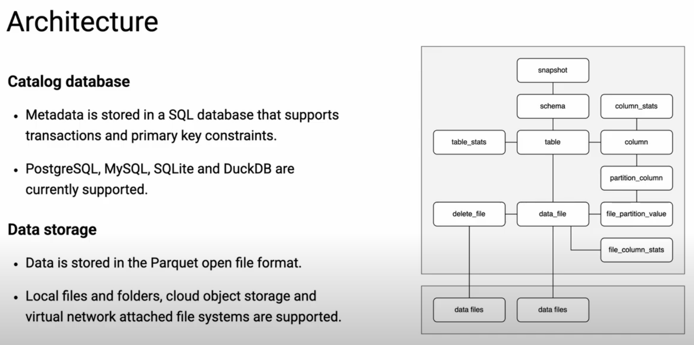
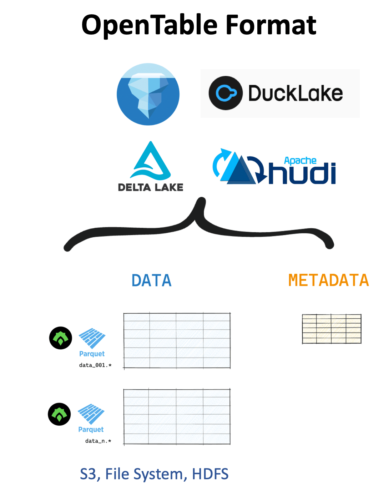

DuckLake demo
================

DuckLake is an integrated data lake and catalog format.


DuckLake architecture:



# OpenTable Format



OpenTable format traits:

- Reliable ACID transactions
- Advanced data skipping
- Time travel
- Schema enforcement and evolution
- Full CRUD operations

# Features

* PostgreSQL database for metadata storage
* MinIO for data storage


# Data Lakes

- lake1: a lake with DuckDB and MinIO
- lake2: a lake with DuckDB and Local File System
- lake2: a lake with PostgreSQL and MinIO

Please refer to [justfile](./justfile) for commands.

# Getting Started

- Start PostgreSQL and MinIO using Docker Compose: docker-compose up -d
- Use DuckDB CLI to create a new lake: `duckdb --cmd "ATTACH 'ducklake:lakes/lake2.ducklake' AS lake2; use lake2;"`
- Create `city` table from [demo.sql](./demo.sql)

# PostgreSQL as catalog metadata store

With `public` schema by default:

```
ATTACH 'ducklake:postgres:dbname=ducklake host=127.0.0.1 port=55432 user=ducklake password=123456' as lake3 (DATA_PATH 's3://lake3');
```

Assigned schema:

```
ATTACH 'ducklake:postgres:dbname=ducklake host=127.0.0.1 port=55432 user=ducklake password=123456' as lake3 (DATA_PATH 's3://lake3', METADATA_SCHEMA 'ducklake');
```

Secret style:

```sql
-- secret for MinIO
create
secret ducklake_oss (
       type s3, 
       key_id 'minioadmin', 
       secret 'minioadmin', 
       endpoint '127.0.0.1:9000', 
       use_ssl false, 
       url_style 'path'
);
       
CREATE
SECRET catalog1 (
	TYPE DUCKLAKE,
	METADATA_PATH 'postgres:dbname=ducklake host=127.0.0.1 port=55432 user=ducklake password=123456',
	DATA_PATH 's3://lake1',
    METADATA_SCHEMA 'ducklake'	
);

ATTACH
'ducklake:catalog1' AS catalog1;

```

**Attention**: Please
refer [Add support for using secrets to manage DuckLake options and credentials](https://github.com/duckdb/ducklake/pull/200)

# Ducklake Friends

* [Neon](https://neon.com/): Ship faster with Postgres
* [Tigris](https://tigrisdata.com/): Globally Distributed S3-Compatible Object Storage

# References

* [DuckLake](https://ducklake.select/)
* Welcome to the age of $10/month Lakehouses: https://tobilg.com/the-age-of-10-dollar-a-month-lakehouses
* Learn How to Use DuckLake with DuckDB to Build Datalakes on
  S3: https://medium.com/@shahsoumil519/learn-how-to-use-ducklake-with-duckdb-to-build-iceberg-tables-on-s3-274ca0495261
* DuckLake: This is your Data Lake on ACID https://www.definite.app/blog/ducklake
* Digging into Ducklake: https://rmoff.net/2025/06/02/digging-into-ducklake/
* DuckLake — DB over File sprawl: https://medium.com/dev-genius/ducklake-db-over-file-sprawl-6613e5c07028
* From DuckDB to DuckHouse: https://juhache.substack.com/p/from-duckdb-to-duckhouse
* Getting Started with DuckLake: A New Table Format for Your
  Lakehouse: https://motherduck.com/blog/getting-started-ducklake-table-format/
* Homemade Change Data Capture into
  DuckLake: https://medium.com/@wergstatt/homemade-change-data-capture-into-your-private-lake-e4978ebc23a7
* DuckDB enters the Lake House race: https://dataengineeringcentral.substack.com/p/duckdb-enters-the-lake-house-race
* Get your data ducks in a row with DuckLake: https://www.tigrisdata.com/blog/ducklake/
* Understanding Open Table Formats: https://delta.io/blog/open-table-formats/
* Data Time Travel with DuckLake and Tigris: https://www.tigrisdata.com/blog/ducklake-time-travel/
* Extract data from Databases into DuckLake: https://blog.slingdata.io/extract-data-from-databases-into-ducklake
* Thinking about DuckLake Architecture: https://www.linkedin.com/pulse/thinking-ducklake-architecture-miguel-peredo-z%C3%BCrcher-lt5ff/
* Building a Complete DuckLake Solution: From Local Development to Cloud Production: https://cfocoder.com/building-a-complete-ducklake-solution-from-local-development-to-cloud-production/
