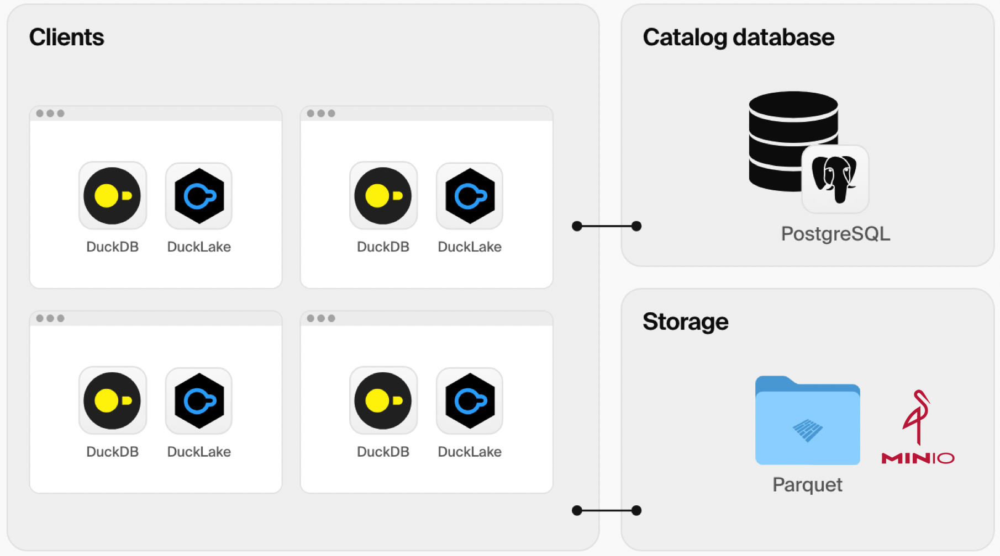

DuckLake demo
================

DuckLake is an integrated data lake and catalog format.

# Features

* PostgreSQL database for metadata storage
* MinIO for data storage

# Data Lakes

- lake1: a lake with DuckDB and MinIO
- lake2: a lake with DuckDB and Local File System
- lake2: a lake with PostgreSQL and MinIO

Please refer [justfile](./justfile) for commands.

# Getting Started

- Start PostgreSQL and MinIO using Docker Compose: docker-compose up -d
- Use DuckDB CLI to create a new lake: `duckdb --cmd "ATTACH 'ducklake:lakes/lake2.ducklake' AS lake2; use lake2;"`
- Create `city` table from [demo.sql](./demo.sql)

# References

* [DuckLake](https://ducklake.select/)
